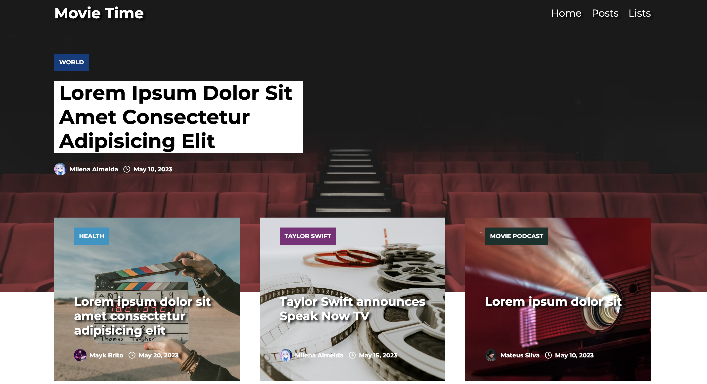

# Side Project Movie Time

<strong>Link para o site em produção:</strong>
https://side-project-movies-blog.vercel.app/



## 💻 Sobre o projeto

Projeto desenvolvido com o propósito de praticar e aperfeiçoar os conhecimentos em Next, utilizando as novas atualizações do framework para estudo e integrando com a API do Notion para usar como CMS na criação dos Posts. Usando como base o layout de um blog.

Utilizando as seguintes tecnologias:
  - [HTML](https://developer.mozilla.org/en-US/docs/Web/HTML);
  - [CSS](https://developer.mozilla.org/en-US/docs/Web/CSS);
  - [TYPESCRIPT](https://www.typescriptlang.org/);
  - [NEXTJS](https://nextjs.org/);

  ## 🚨 Como baixar o projeto

  Antes de começar, você vai precisar ter um editor para trabalhar com o código como VSCode.

  ### 🏁 Para rodar a aplicação

  ```bash
    # Clonar o repositório
    $ git clone https://github.com/milealmeida/side-project-movies-blog

    # Entrar no diretório
    $ cd {nomepasta}

    # Para abrir o Visual Studio Code
    $ code .

    # Instalar o projeto (digitar no terminal)
    $ yarn

    # Rodar o projeto na máquina (digitar no terminal)
    $ yarn dev

    # Isso fará com que o projeto rode na porta
    http://localhost:3000/
```

  ### 🏁 Para clonar o Notion

  [Clique aqui](https://milealmeida.notion.site/82b42eec983240f6ad8711664c9ecd60?v=ded717aa61554ebe809664c9834b4c5d) para clonar o template do Notion.

  Desenvolvido com 💙 por Milena Almeida.
